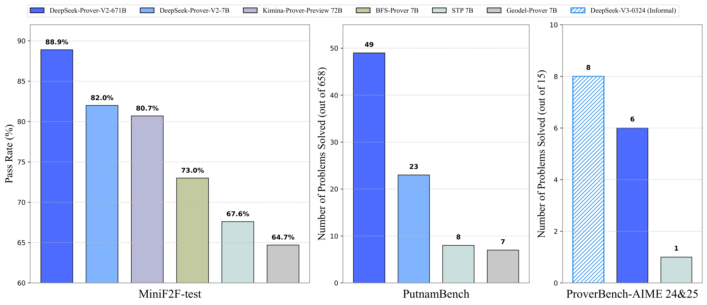

<!-- markdownlint-disable first-line-h1 -->
<!-- markdownlint-disable html -->
<!-- markdownlint-disable no-duplicate-header -->

<div align="center">
  
</div>
<hr>
<div align="center" style="line-height: 1;">
  <a href="https://www.deepseek.com/"></a>
  <a href="https://chat.deepseek.com/"></a>
  <a href="https://huggingface.co/deepseek-ai"></a>
  <br>
  <a href="https://discord.gg/Tc7c45Zzu5"></a>
  <a href="https://github.com/deepseek-ai/DeepSeek-V2/blob/main/figures/qr.jpeg?raw=true"></a>
  <a href="https://twitter.com/deepseek_ai"></a>
  <br>
  <a href="https://github.com/deepseek-ai/DeepSeek-V3/blob/main/LICENSE-CODE"></a>
  <a href="https://github.com/deepseek-ai/DeepSeek-V3/blob/main/LICENSE-MODEL"></a>
  <br>
  <a href="https://github.com/deepseek-ai/DeepSeek-Prover-V2/blob/master/DeepSeek_Prover_V2.pdf"><b>Paper Link</b>👁️</a>
</div>
<p align="center">
  <a href="#2-model-summary">Model Summary</a> |
  <a href="#3-proverbench">ProverBench</a> |
  <a href="#4-model-dataset-downloads">Model&Dataset Download</a> |
  <a href="#5-quick-start">Quick Start</a> |
  <a href="#6-license">License</a> |
  <a href="#7-contact">Contact</a>
</p>

# DeepSeek-Prover-V2: Advancing Formal Mathematical Reasoning via Reinforcement Learning for Subgoal Decomposition

## 1. Introduction

We introduce DeepSeek-Prover-V2, an open-source large language model designed for formal theorem proving in Lean 4, with initialization data collected through a recursive theorem proving pipeline powered by DeepSeek-V3. The cold-start training procedure begins by prompting DeepSeek-V3 to decompose complex problems into a series of subgoals. The proofs of resolved subgoals are synthesized into a chain-of-thought process, combined with DeepSeek-V3's step-by-step reasoning, to create an initial cold start for reinforcement learning. This process enables us to integrate both informal and formal mathematical reasoning into a unified model.

<p align="center">
  
</p>

## 2. Model Summary

---

**Synthesize Cold-Start Reasoning Data through Recursive Proof Search**

- To construct the cold-start dataset, we develop a simple yet effective pipeline for recursive theorem proving, utilizing DeepSeek-V3 as a unified tool for both subgoal decomposition and formalization. We prompt DeepSeek-V3 to decompose theorems into high-level proof sketches while simultaneously formalizing these proof steps in Lean 4, resulting in a sequence of subgoals.

- We use a smaller 7B model to handle the proof search for each subgoal, thereby reducing the associated computational burden. Once the decomposed steps of a challenging problem are resolved, we pair the complete step-by-step formal proof with the corresponding chain-of-thought from DeepSeek-V3 to create cold-start reasoning data.

---

**Reinforcement Learning with Synthetic Cold-Start Data**

- We curate a subset of challenging problems that remain unsolved by the 7B prover model in an end-to-end manner, but for which all decomposed subgoals have been successfully resolved. By composing the proofs of all subgoals, we construct a complete formal proof for the original problem. This proof is then appended to DeepSeek-V3's chain-of-thought, which outlines the corresponding lemma decomposition, thereby producing a cohesive synthesis of informal reasoning and subsequent formalization.

- After fine-tuning the prover model on the synthetic cold-start data, we perform a reinforcement learning stage to further enhance its ability to bridge informal reasoning with formal proof construction. Following the standard training objective for reasoning models, we use binary correct-or-incorrect feedback as the primary form of reward supervision.
- The resulting model, DeepSeek-Prover-V2-671B, achieves state-of-the-art performance in neural theorem proving, reaching $88.9$% pass ratio on the MiniF2F-test and solving 49 out of 658 problems from PutnamBench. The proofs generated by DeepSeek-Prover-V2 for the miniF2F dataset are available for download as a [ZIP archive](https://github.com/deepseek-ai/DeepSeek-Prover-V2/blob/master/minif2f-solutions.zip).

---

## 3. ProverBench: Formalization of AIME and Textbook Problems

we introduce ProverBench, a benchmark dataset comprising 325 problems. Of these, 15 are formalized from number theory and algebra questions featured in the recent AIME competitions (AIME 24 and 25), offering authentic high-school competition-level challenges. The remaining 310 problems are drawn from curated textbook examples and educational tutorials, contributing a diverse and pedagogically grounded collection of formalized mathematical problems. This benchmark is designed to enable more comprehensive evaluation across both high-school competition problems and undergraduate-level mathematics.

<div align="center">

| Area                | Count |
| :---------------------: | :-------: |
| AIME 24&25          | 15    |
| Number Theory       | 40    |
| Elementary Algebra  | 30    |
| Linear Algebra      | 50    |
| Abstract Algebra    | 40    |
| Calculus            | 90    |
| Real Analysis       | 30    |
| Complex Analysis    | 10    |
| Functional Analysis | 10    |
| Probability         | 10    |
| Total               | 325   |

</div>

## 4. Model & Dataset Downloads

We release DeepSeek-Prover-V2 in two model sizes: 7B and 671B parameters. DeepSeek-Prover-V2-671B is trained on top of DeepSeek-V3-Base. DeepSeek-Prover-V2-7B is built upon DeepSeek-Prover-V1.5-Base and features an extended context length of up to 32K tokens.

<div align="center">

|            **Model**            |                          **Download**                         |
| :-----------------------------: | :----------------------------------------------------------: |
|   DeepSeek-Prover-V2-7B   | [🤗 HuggingFace](https://huggingface.co/deepseek-ai/DeepSeek-Prover-V2-7B) |
|   DeepSeek-Prover-V2-671B   | [🤗 HuggingFace](https://huggingface.co/deepseek-ai/DeepSeek-Prover-V2-671B) |

</div>

<div align="center">

|            **Dataset**            |                          **Download**                         |
| :-----------------------------: | :----------------------------------------------------------: |
|   DeepSeek-ProverBench   | [🤗 HuggingFace](https://huggingface.co/datasets/deepseek-ai/DeepSeek-ProverBench) |

</div>

## 5. Quick Start

You can directly use [Huggingface's Transformers](https://github.com/huggingface/transformers) for model inference. DeepSeek-Prover-V2-671B shares the same architecture as DeepSeek-V3. For detailed information and supported features, please refer to [the DeepSeek-V3 documentation on Hugging Face](https://github.com/huggingface/transformers/blob/main/docs/source/en/model_doc/deepseek_v3.md).

The following is a basic example of generating a proof for a problem from the miniF2F dataset:
````python
from transformers import AutoModelForCausalLM, AutoTokenizer
import torch
torch.manual_seed(30)

model_id = "DeepSeek-Prover-V2-7B"  # or DeepSeek-Prover-V2-671B
tokenizer = AutoTokenizer.from_pretrained(model_id)

formal_statement = """
import Mathlib
import Aesop

set_option maxHeartbeats 0

open BigOperators Real Nat Topology Rat

/-- What is the positive difference between $120\%$ of 30 and $130\%$ of 20? Show that it is 10.-/
theorem mathd_algebra_10 : abs ((120 : ℝ) / 100 * 30 - 130 / 100 * 20) = 10 := by
  sorry
""".strip()

prompt = """
Complete the following Lean 4 code:

```lean4
{}
```

Before producing the Lean 4 code to formally prove the given theorem, provide a detailed proof plan outlining the main proof steps and strategies.
The plan should highlight key ideas, intermediate lemmas, and proof structures that will guide the construction of the final formal proof.
""".strip()

chat = [
  {"role": "user", "content": prompt.format(formal_statement)},
]

model = AutoModelForCausalLM.from_pretrained(model_id, device_map="auto", torch_dtype=torch.bfloat16, trust_remote_code=True)
inputs = tokenizer.apply_chat_template(chat, tokenize=True, add_generation_prompt=True, return_tensors="pt").to(model.device)

import time
start = time.time()
outputs = model.generate(inputs, max_new_tokens=8192)
print(tokenizer.batch_decode(outputs))
print(time.time() - start)
````

## 6. License
The use of DeepSeek-Prover-V2 models is subject to [the Model License](LICENSE-MODEL).

## 7. Contact

If you have any questions, please raise an issue or contact us at [service@deepseek.com](mailto:service@deepseek.com).
